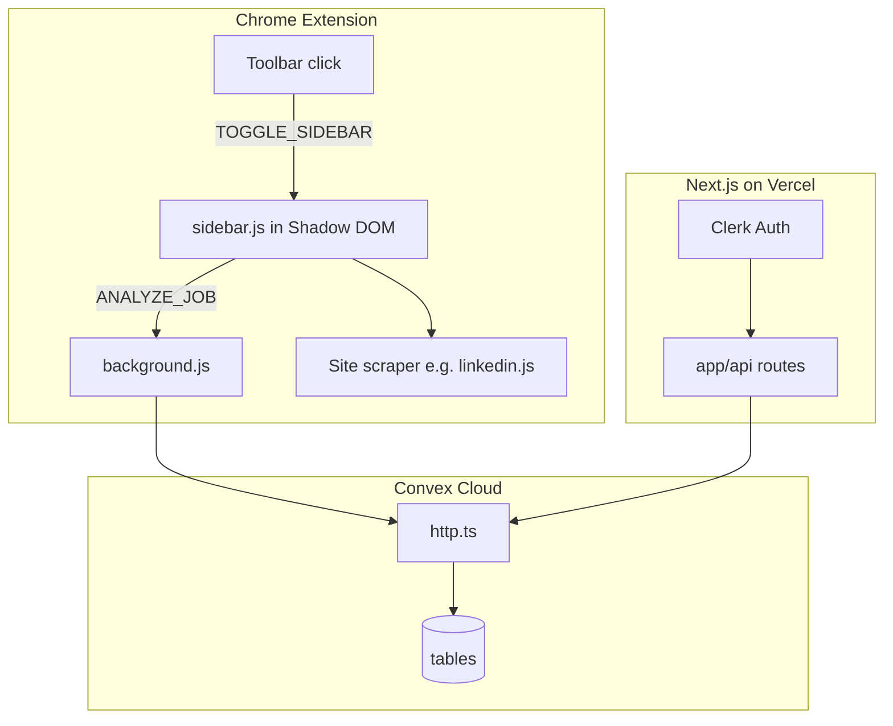

# Fluxpage — ATS Resume Assistant

**Fluxpage** is a full-stack job-application toolkit: a **Chrome extension (MV3)** that scores your resume against live job descriptions on major job boards, plus a **Next.js web app** and **Convex backend** for resume editing, tailoring, billing, and sync.

Production site: [https://www.fluxpage.com](https://www.fluxpage.com)

---

## What you get

| Surface | Location | Purpose |
|---------|----------|---------|
| Chrome extension | [`extension/`](extension/) | Shadow-DOM sidebar on job pages; JD scrape, ATS score, saved jobs, extension login |
| Web app | [`web/`](web/) | Dashboard, resume editor, templates, tailor flow, Clerk auth, Razorpay billing |
| Convex backend | [`convex/`](convex/) | Users, resumes, jobs, ATS scoring, cover letters, HTTP actions for extension + web |
| PDF API (optional) | [`backend/`](backend/) | Local FastAPI service for PDF text extraction on port 8000 |
| LaTeX compiler (optional) | [`latex-compiler/`](latex-compiler/) | Dockerized helper for advanced resume PDF generation |

---

## Features

### Chrome extension

- **Supported job sites:** LinkedIn, Internshala, Naukri, Indeed, Glassdoor
- **Shadow DOM sidebar** — slides in from the right; CSP-safe styling isolated from page CSS
- **Floating action button** on detected job pages
- **JD keyword highlighter** for missing terms after analysis
- **Per-site scrapers** with MutationObserver + “show more” expansion for full job text
- **Resume upload** (PDF / DOCX / TXT) with local storage and Convex sync when signed in
- **Toolbar icon** — Fluxpage brand mark (PNG generated from `logo-mark.svg`)
- **OAuth** via `callback.html` → fluxpage.com Clerk session

### Web app

- Resume editor with Monaco, ATS-friendly templates (Modern / Classic / Compact)
- Job tracker, analytics dashboard, billing (Pro / Premium via Razorpay)
- AI-assisted tailor, cover letter, interview prep (Gemini or OpenRouter)
- Clerk sign-in with sync to Convex (`/auth/sync`)

### Backend (Convex)

- Schema for users, resumes, jobs, drafts, tailoring runs, billing tiers
- HTTP actions consumed by the extension service worker and Next.js API routes

---

## Repository layout

```
FluxPage/
├── extension/           Chrome MV3 extension (load unpacked or npm run extension:pack)
│   ├── manifest.json
│   ├── background.js    Service worker — API calls, auth, messaging
│   ├── content/         Site scrapers, sidebar, floating button, highlighter
│   ├── popup/           Extension popup UI
│   ├── icons/           logo-mark.svg, logo.svg, icon16–128.png (generated)
│   └── lib/pdfjs/       Bundled PDF.js for in-extension parsing
├── web/                 Next.js 14 app (Vercel root directory: web/)
│   ├── app/             Routes: dashboard, editor, auth, API
│   ├── components/      UI, resume templates, Clerk forms
│   ├── lib/             API client, Razorpay, resume parser
│   └── public/brand/    Web favicon / logo SVGs
├── convex/              Convex functions + schema
├── backend/             Optional Python PDF extraction API
├── latex-compiler/      Optional Docker LaTeX compile helper
├── scripts/             extension:build, pack, icon generation, git helpers
├── package.json         Root scripts (convex, extension)
└── convex.json          Convex project config
```

---

## Architecture



### Extension message types

| Type | From | To | Purpose |
|------|------|-----|---------|
| `TOGGLE_SIDEBAR` | background | content | Show/hide sidebar |
| `ANALYZE_JOB` | content | background | Scrape JD + score resume via Convex HTTP |

### Storage keys (`chrome.storage.local`)

| Key | Description |
|-----|-------------|
| `rf_resumes` | Uploaded resume list (base64, labels, sync ids) |
| `rf_auth` | Extension session tokens after web login |
| `rf_last_analysis` | Latest ATS result for current tab |
| `rf_saved_jobs` | Bookmarked jobs from sidebar |
| `rf_active_tab` | Sidebar UI tab state |
| `rf_settings` | API endpoint overrides (legacy / dev) |

Config injected at build time: `globalThis.__RESUMOD_CONFIG__` in `config.generated.js` (`API_BASE`, `WEB_BASE`, `LOCAL_PDF_API`).

---

## Prerequisites

- **Node.js** 18+
- **Google Chrome** (for extension development)
- **Convex CLI** — `npm i -g convex` or use `npx convex`
- **Accounts (production):** [Clerk](https://clerk.com), [Razorpay](https://razorpay.com), [Convex](https://convex.dev)
- **Optional:** Python 3.11+ for [`backend/`](backend/), Docker for [`latex-compiler/`](latex-compiler/)

---

## Quick start (local development)

### 1. Clone and install

```bash
git clone https://github.com/rohitkumarrai7/FluxPage.git
cd FluxPage
npm install
cd web && npm install && cd ..
```

### 2. Environment

Copy [`web/.env.example`](web/.env.example) to `web/.env.local` and fill in Clerk, Convex, and optional AI keys.  
See [`web/DEPLOY.md`](web/DEPLOY.md) for the full variable list.

### 3. Convex

**Production:** `stoic-caiman-320` — see [docs/PRODUCTION_CONVEX.md](docs/PRODUCTION_CONVEX.md)

From the repo root:

```bash
npx convex dev
```

Deploy production backend:

```bash
npx convex deploy
```

### 4. Web app

```bash
cd web
npm run dev
```

Open [http://localhost:3000](http://localhost:3000).

### 5. Chrome extension

```bash
npm run extension:dev
```

Then in Chrome: **Extensions → Developer mode → Load unpacked** → select the `extension/` folder.

Toolbar icons are regenerated from `extension/icons/logo-mark.svg` on each build.

---

## Build commands

| Command | Description |
|---------|-------------|
| `npm run extension:icons` | Regenerate `icon16.png` … `icon128.png` from brand SVG |
| `npm run extension:build` | Icons + `config.generated.js` + prod manifest hosts |
| `npm run extension:dev` | Icons + dev manifest (localhost Convex/web) |
| `npm run extension:pack` | Build + zip → `extension/fluxpage-extension.zip` |
| `npm run convex:dev` | Local Convex dev deployment |
| `npm run convex:deploy` | Deploy Convex to production |
| `cd web && npm run build` | Production Next.js build |

---

## Deployment

Full production checklist: **[web/DEPLOY.md](web/DEPLOY.md)**

Summary:

1. `npx convex deploy` — set `CLERK_SYNC_SECRET`, `WEB_BASE`, Razorpay internal secret in Convex dashboard
2. Deploy `web/` on Vercel with env vars from `.env.example`
3. `npm run extension:build` with `EXTENSION_API_BASE` and `EXTENSION_WEB_BASE` pointing at production
4. Load or publish the `extension/` folder / zip

Extension developer details: **[extension/README.md](extension/README.md)**

---

## CSP and Shadow DOM (job board pages)

LinkedIn and similar sites use strict CSP. Fluxpage follows these rules in [`extension/content/sidebar.js`](extension/content/sidebar.js):

| Risk | Mitigation |
|------|------------|
| Global `<style>` blocked | Styles live inside **Shadow DOM** `innerHTML` |
| Inline `onclick` | **Never** — only `addEventListener` |
| Injected `<script src>` | **Never** — all JS from `manifest.json` content_scripts |
| Page CSS bleeding | `attachShadow({ mode: "open" })` |
| Page blocking extension `fetch` | API calls in **background service worker** (not page CSP) |

If styling breaks on a new site, check DevTools for `Refused to apply style` and add inline fallbacks on critical layout nodes.

---

## Site scraper injection

Each supported host gets site-specific scripts **before** `sidebar.js`:

```
config.generated.js → extract-common.js → <site>.js → sidebar.js
```

Universal scripts (`detector.js`, `floating-button.js`, `jd-highlighter.js`) run on `<all_urls>` for detection and highlighting.

---

## Environment variables

| Where | File / UI |
|-------|-----------|
| Web (Vercel / local) | [`web/.env.example`](web/.env.example) |
| Convex dashboard | `CLERK_SYNC_SECRET`, `WEB_BASE`, `ALLOWED_ORIGINS`, … |
| Extension build | `EXTENSION_API_BASE`, `EXTENSION_WEB_BASE`, `EXTENSION_LOCAL_PDF_API` |

Never commit `.env.local` or API secrets.

---

## Optional services

### PDF extraction API

```bash
cd backend
pip install -r requirements.txt
uvicorn main:app --reload --port 8000
```

Set `EXTENSION_LOCAL_PDF_API=http://localhost:8000` when running `npm run extension:dev`.

### LaTeX compiler

```bash
cd latex-compiler
docker build -t fluxpage-latex .
```

Used for advanced PDF export paths in the web editor pipeline.

---

## Troubleshooting

| Issue | Fix |
|-------|-----|
| Sidebar has no styles on LinkedIn | Confirm shadow-root `<style>` block; check CSP console errors |
| “Auth not configured” on web | Set Clerk keys in Vercel / `.env.local` — see DEPLOY.md |
| Extension cannot reach API | Run `npm run extension:build`; verify `host_permissions` and Convex HTTP URL |
| Stale toolbar icon | Run `npm run extension:icons` and reload extension |

---

## License

Proprietary — © Fluxpage. All rights reserved unless otherwise noted in the repository.
